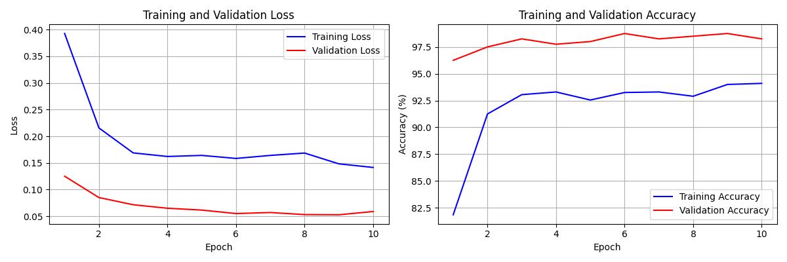

# Cat vs Dog Image Classifier

A binary image classification model built with PyTorch that distinguishes between cats and dogs using transfer learning with ResNet18.

## Project Overview

This project implements a convolutional neural network (CNN) for classifying images as either cats or dogs. Since it was a first project on computer vision, rather than training a model from scratch, it uses a ResNet18 model pretrained on ImageNet and applies fine-tuning only in the final classification layer.

### Key Results

| Metric | Value |
|--------|-------|
| Validation Accuracy | 98% |
| Training Accuracy | 94% |
| Training Images | 2,000 (1,000 per class) |
| Validation Images | 200 (100 per class) |
| Training Time | ~10 epochs |

## Technical Approach

### Transfer Learning with ResNet18

ResNet18 is an 18-layer deep residual network pretrained on ImageNet, a dataset containing over 14 million images across 1,000 categories. The pretrained model has already learned to extract importat visual features such as edges, textures, shapes and object parts.

The transfer learning strategy employed in this project:

1. Load ResNet18 with pretrained ImageNet weights
2. Freeze all convolutional layers (approximately 11 million parameters)
3. Replace the final fully connected layer (originally 1,000 outputs) with a new layer outputting 2 classes (dogs and cats)
4. Train only the new classification layer (approximately 1,000 parameters)

This approach works because the features learned on ImageNet generalize well to other image classification tasks. The frozen layers act as a fixed feature extractor, while the trainable final layer learns to map those features to our specific classes.

### Data Preprocessing

All images undergo the following preprocessing pipeline:

**Training transforms:**
- Resize to 256 pixels on the shorter side
- Random crop to 224×224 pixels
- Random horizontal flip (50% probability)
- Color jitter (brightness, contrast, saturation adjustments)
- Normalization using ImageNet statistics (mean: [0.485, 0.456, 0.406], std: [0.229, 0.224, 0.225])

**Validation transforms:**
- Resize to 256 pixels on the shorter side
- Center crop to 224×224 pixels
- Normalization using ImageNet statistics

The data augmentation during training helps the model generalize by presenting variations of each image, while validation uses deterministic transforms for consistent evaluation.

### Training Configuration

| Parameter | Value |
|-----------|-------|
| Optimizer | Adam |
| Learning Rate | 0.001 |
| Learning Rate Scheduler | ReduceLROnPlateau (factor=0.5, patience=2) |
| Loss Function | CrossEntropyLoss |
| Batch Size | 32 |

## Training Results

The training history plots below show the model's learning progression over 10 epochs:



### Loss Analysis

The training loss started at approximately 0.40 and decreased steadily to around 0.14 by the final epoch, with the steepest improvement occurring in the first two epochs. The validation loss began lower at approximately 0.12 and decreased to around 0.05, remaining consistently below the training loss throughout training.

### Accuracy Analysis

Training accuracy improved from approximately 82% to 94% over the course of training. Validation accuracy started at approximately 96% and reached 98% by the final epochs.

### Interpretation

The validation metrics exceeding training metrics is characteristic of transfer learning with data augmentation. This pattern occurs because training images undergo random augmentation (crops, flips, color changes) making them more challenging to classify, while validation images use simple center crops without augmentation. Additionally, the pretrained features work well out of the box on this task. This pattern indicates the model generalizes well and is not overfitting.

## Model Testing

The trained model was evaluated on 20 images (10 cats, 10 dogs) not used during training or validation:

| Class | Correct | Total | Accuracy |
|-------|---------|-------|----------|
| Dogs | 10 | 10 | 100% |
| Cats | 9 | 10 | 90% |
| Overall | 19 | 20 | 95% |

The single misclassification (the number 5 photo in the predict folder) was an image of two cats behind metal bars (resembling a cage), which the model classified as a dog with 53.3% confidence. The low confidence score indicates the model recognized uncertainty when faced with an unusual image that differed significantly from the training distribution.

## Dataset

**Source:** [Kaggle Dogs vs Cats Competition](https://www.kaggle.com/c/dogs-vs-cats/data)

**Structure:**
```
data/
├── train/
│   ├── cats/     (1,000 images)
│   └── dogs/     (1,000 images)
└── validate/
    ├── cats/     (100 images)
    └── dogs/     (100 images)
```

Images were manually split from the Kaggle training set, ensuring no overlap between training and validation sets.


### File Descriptions

| File | Description |
|------|-------------|
| `dataset.py` | Data loading and preprocessing pipeline using torchvision transforms and ImageFolder |
| `model.py` | Model architecture definition with ResNet18 transfer learning setup and layer freezing utilities |
| `train.py` | Training loop implementation with validation, checkpointing, learning rate scheduling, and visualization |
| `predict.py` | Inference script for classifying new images using command-line arguments |

## Requirements

- Python 3.8+
- PyTorch 2.0+
- torchvision
- Pillow
- matplotlib

## Usage

### Training

```bash
python train.py
```

Training parameters can be modified in the `train()` function call at the bottom of `train.py`:

```python
train(
    data_dir='data',
    num_epochs=10,
    batch_size=32,
    learning_rate=0.001,
    save_dir='checkpoints'
)
```

### Inference

Classify a single image using the best trained model in 10 epochs:
```bash
python predict.py --image path/to/photo.jpg
```

Specify the last model checkpoint to use the full trained model after 10 epochs:
```bash
python predict.py --image path/to/photo.jpg --model checkpoints/final_model.pth
```

Example output:
```
Using device: cuda
Model loaded from checkpoints/best_model.pth
Trained for 6 epochs
Validation accuracy: 98.00%

Prediction Results:
============================================================
photo.jpg
  Prediction: CAT
  Confidence: 97.3%
```

## Hardware

Training was performed with CUDA GPU acceleration. The code automatically detects and uses GPU if available, falling back to CPU otherwise.

## License

MIT